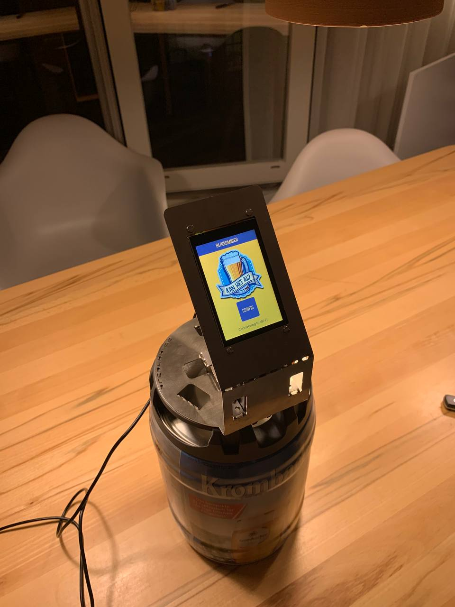
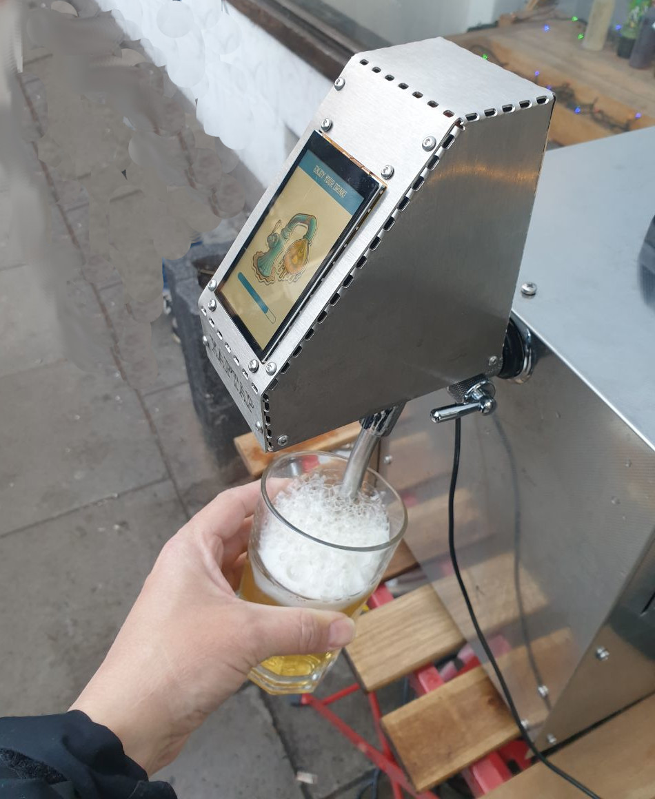
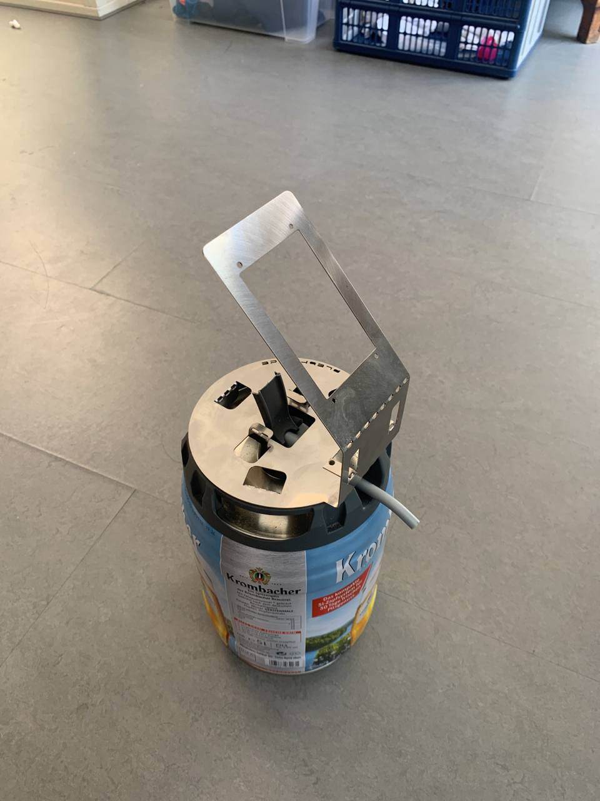

# BliksemBier, a Bitcoin Lightning enabled beertap

BliksemBier is a beertap that accepts Bitcoin. BliksemBier consists of two components: na LNbits (https://github.com/lnbits/lnbits) extension and firmware for an ESP32-based smart display (made by Sunton). The firmware for the tap is created in such a way that can be used for different beertap types. For 5L draught kegs to professional beertaps. The following pictures illustrate some of the applications of BliksemBier.

 

If you want to obtain or create such a beertap, you can buy one or create one yourself (see the [build instructions](#build-instructions) for more details). All components, except for the metal sheet, are readily available. The design for the metal sheet is available <a href="Hardware/draught_key_sheet_bliksembier.dxf">here</a>. This should be laser cut out of a 1mm - 1.5mm stainless steel sheet. As that can be quite expensive for a few items, you can also obtain one from me. Contact <a href="mailto:bliksembier@meulenhoff.org">me</a> for details.



## Contact, support and licensing

If you want to contact me directly, send an e-mail to <a href="mailto:bliksembier@meulenhoff.org">bliksembier@meulenhoff.org</a>.

You can also join the Telegram group (https://t.me/+NLCoqbPB_ro1NzRk). 

This software is available under the GPL License (see LICENSE). If your application of BliksemBier requires and another type of license, contact me by sending an e-mail to <a href="mailto:bliksembier@meulenhoff.org">bliksembier@meulenhoff.org</a>. 

## Installation

To get the beertap up and running, take the following steps:

1. Make sure your LNbits server has the BliksemBier extension installed. If not contact the administrator of your LNbits server and ask to install the BliksemBier extension from the following source:
   ```
   https://lnbits.meulenhoff.org/extensions/extensions.json
   ```
2. In LNbits, add the BliksemBier extension to your wallet.
3. Select the 'BliksemBier' extension and clik the 'New Device' button.
4. Configure the device with a title, wallet, currency and at least one switch (up to three switches are supported). If unsure, no problem, you can change the configuration anytime.
  * The duration is the amount of milliseconds, the tap is switched on.
  * The Label button is displayed on the tap. For instance 'SMALL' or 'LARGE'. Currently, only a limited subset of characters is support (CAPS ONLY).
5. Click 'CREATE DEVICE' and record the ID of the LNURLdevice (8 charachters).

Now move over to the beertap itself. If you need to flash (new) firmware to the device, go to step 12.

6. Power on the beertap and click the 'Config' button.
7. Enter the PIN (the initial PIN is 123456)
8. Configure SSID and Secret to connect the tap to a Wi-Fi network.
9. Make sure that LNbits host is set to: lnbits.meulenhoff.org
10. Set 'Device ID' to the ID of the LNURL device (from step 6). 
11. Click connect. 

If all went as planned, the status says: Wi-Fi connected, Configuration loaded, WebSocket connected and 'Ready to Serve!'. You can click on one of the buttons and scan the QR code. 

The flash new firmware on the device, make sure you are using LNbits with the Chrome (or Edge) browser.

12. Connect the Micro USB port of the ESP32 to your computer.
13. In the BliksemBier extension, select the correct ESP32 board and click the flash button to start the flashing process.
  * In some cases, flashing only works the second time.
  * The 'Boot button' that is mentioned during flashing is typically not required. However, the boot button is located on the back of the ESP32 device (next to the reset button). Pressing both at the same time (while having the ESP32 connected to your computer) usually does the trick.
  
## Required components

A list of components required to build a BliksemBier tap for 5L draught kegs:

  * Sunton ESP32 Capacitive touch display 3.5 inch (https://aliexpress.com/item/1005004632953455.html)
  * One MG995 servo
  * 2 JST 1.25 connectors
  * A stainless sheet fixture
  * USB-C connector for power (https://www.aliexpress.com/item/1005005137763022.html)
  * USB 5V power source of at least 2A @ 5V
  * Some screws and wiring:
    * 4 M3 bolts (20 mm)
    * 4 4mm spacers
    * 8 M3 nuts
    * 1 M4 bolt (15 mm)
    * 1 M4 Locking nut
  * A box for the backside (I used a Strapubox 2515)
  * soldering utensils and a small piece of heat shrink
     
## Build  instructions

Both the ESP32 and the Servo are powered from the 5V source. As the servo is quite strong, a weak power source will result in glitches of the display. Make sure your power source is strong enough. Also it is important not to pass the current for the servo through the ESP32. This means that both the ESP32 and the Servo are directly powered from the same 5V power source. Use the following guidelines to connect everything.

  * The 5V power connects to the VIN of the ESP32 and the power input of the servo (middle cable)
  * The GND of the power input connects to the GND of the ESP32 and the GND of the servo (black cable)
  * Port 21 of the ESP32 connects to the signal input of the servo (Yellow cable).
  * Use the JST connectors to connect both power and signal (PIN 21). 

Connecting everything together may require some soldering and heat shrink. A closeup of the backside should like similar to the following.


The box for the backside of the tap is a converted strapubox that comes in two identical covers. I cut of the rims of the box, made a hole for the USBC connector and drilled four holes to mount the cover on the same bolts that mount the display to the metal fixture.

## Compilation

To compile the project from within Visual Studio Code using platform.io, take the following steps:

  1. Install Visual Studio Code. Download from https://code.visualstudio.com/. If Git is not yet installed on your system, you need to install that as well.
  2. Install the Platform IO extension. Open the Extension Manager (click the wheel icon at the bottom of the bar and the left and select Extensions). Search for PlatformIO, and click 'Install'.
  3. In Visual Studio code, open the command palette (Ctrl-Shift-P) and type 'gitcl'.
  4. When prompted for the repository URL, enter the URL of this repository: `https://github.com/pieterjm/BliksemBier.git`
  5. Select a local directrory where to store the repository and open the repository.
  6. To compile, click the checkmark icon in the blue bar at the bottom to compile the repository. This may take a while as external libraries have to be loaded.
  7. Connect the device to USB port and click the '>' button in the blue bar at the bottom to compile and flash the firmware.
  8. After compilation and firmware flashing is succesful, the device should restart as a fresh Btap.
  
To compile the project using platformio core only, take the following steps

  1. Install platformio core by following the instructions here: https://docs.platformio.org/en/stable/core/installation/methods/installer-script.html
  2. Clone the repository with the following command
     ```
     git clone https://github.com/pieterjm/BliksemBier.git
     ```
  3. Compile and upload
     ```
     cd BliksemBier
     platformio run --target upload
     ```

