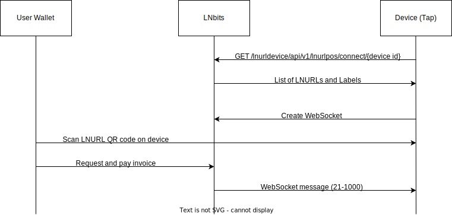

# Process flow

The global process from startup until making a succesfull payment is depicted in the following figure:

The tap is configured with a 'Device ID', which refers to an LNURL device in LNbits. Upon startup the tap retrieves payment configuration from LNbits using this ID. LNbits response with a JSON formatted message that contains all configured Switches, and for each switch, the LNURL and Label. Upon receiving that information, the tap configures buttons and QR codes. Finally a WebSocket connection is opened where the tap listens for incoming messages from LNbits.

When a user wants to order a beer, the desired button is pressed on the tap. This triggers the device to display the appropriate LNURL for the switch.

The user pays for the beer by retrieving an invoice from LNbits and paying the invoice. 

After succesfull payment, a simple text message is sent over the WebSocket. The message is formatted as 'A-B' where A and B are integers. A references the GPIO PIN to be triggered, B is the time (ms) to enable the PIN. So for a larger beer, B should be increased. 

